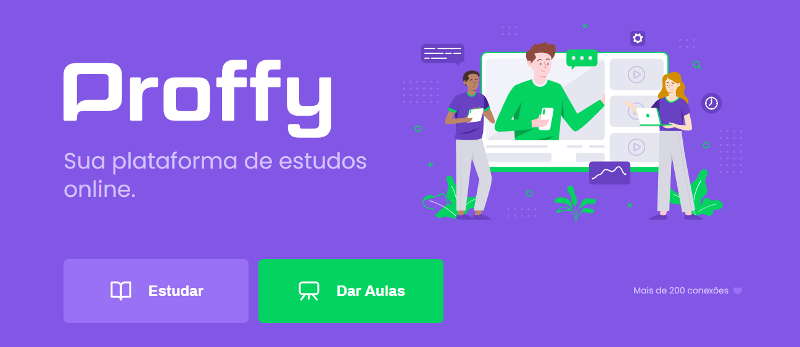

<div  align="center">

<H1>Proffy - Next Level Week 2.0</h1>

 <a aria-label="Completed" href="https://nextlevelweek.com/episodios/omnistack/edicao/2">
    </img>
  </a>


 <strong>Este projeto foi desenvolvido na Next Level Week 2.0 , oferecida pela <a href="https://rocketseat.com.br/">RocketSeat</a> e lecionada pelo <a href="https://github.com/diego3g">Diego Fernandes</a>.<strong>
<br>
<br>
<br>
<br>
 
 
:rocket: *Projeto feito para conectar alunos a professores.*

</div>

  

# :bulb: Ideia do projeto:

A ideia do projeto foi utilizar as principais tecnologias presentes no mercado, para ajudar os alunos e professores, assim dando a eles uma plataforma para que os professores estimulassem valores pelas aulas, matéria na qual é especializado. Após isso, o aluno mediante ao aplicativo entraria em contato com o professor que for da sua necessidade comprando a aula.

  
# :art: Design do projeto: 

<div align="center">
<h1>DESKTOP:</H1>
<br>
<br>
<h6>Home Desktop: </h6>


<br>
<br>
<h6>Formulario de cadastro de professor: </h6>

<br>
<br>
<h6>Listagem de professores: </h6>

<br>
<br>
<h1>Mobile</h1>
<h6>Home Mobile: </h6>

<br>
<br>
<h6>Listagem de professores: </h6>

<br>
<br>
</div>


#  </> Tecnologias:

  

Este projeto foi feito utilizando as seguintes tecnologias.

 
<ul>

<li><a  href="https://nodejs.org/en/docs/">NodeJs</a></li>

<li><a  href="https://www.typescriptlang.org/">Typescript</a></li>

<li><a  href="https://pt-br.reactjs.org/">React</a></li>

<li><a  href="https://reactnative.dev/">React Native</a></li>

<li><a  href="https://expo.io/">Expo</a></li>

</ul>

  

# :construction_worker: Como executar o projeto:

  

### :computer: Faça o download do Projeto:

  

```bash

# Clone o repositorio na sua maquina

$ git clone https://github.com/gabrielpulga/nlw2-proffy.git

```

  

### 💻 Executando o projeto no seu browser:

  

#### Front-end

  

```bash

# Vá até a pagina do projeto

$ cd web

  

# Instale os pacotes

Yarn
$ yarn install 

NPM
$ npm install
  

# Executando aplicações


Yarn
$ yarn start 

NPM
$ npm run start

```

  
Endereço do front-end: http://localhost:3000/.

  

#### Back-end

  

```bash

# Vá até a pagina do projeto

$ cd server

  

# Instale os pacotes

Yarn
$ yarn install 

NPM
$ npm install
  

# Executando aplicações


Yarn
$ yarn start 

NPM
$ npm run start


# Faça as migrações(Criação do banco)

Yarn
$ yarn knex:migrate

NPM
$ npm run knex:migrate


```

  

API disponivel para ser testada em : http://localhost:3333/.

  

### 📱 Executando o Mobile

  

Para executar(Emular) este projeto é necessario o aplicativo do Expo: [expo](https://play.google.com/store/apps/details?id=host.exp.exponent) .

<br />

  

```bash
# Vá até a pagina do projeto
$ cd mobile/

 # Instale os pacotes

Yarn
$ yarn install 

NPM
$ npm install
  

# Executando aplicações


Yarn
$ yarn start 

NPM
$ npm run start


  

<!--Você pode ler o QRCode with [expo](https://play.google.com/store/apps/details?id=host.exp.exponent) or through an emulator.-->

  

  

# :closed_book: Licença


Feito em 2020.

  
Feito com muito esforço e dedicação:  [Lucas Leite](https://github.com/lcsxz) :brazil:.

Este projeto conta com uma licença [MIT license](https://github.com/gabrielpulga/nlw2-proffy/blob/master/LICENSE).

  
Me de uma ⭐️ se esse projeto te ajudou!


